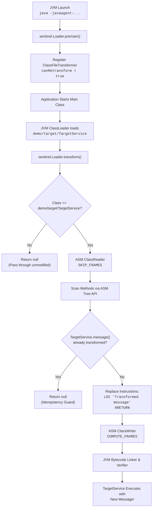

# Sentinel Java Agent

> [!NOTE]
> **[ByteGuard / Sentinel 1.0.0 is live](https://github.com/jojin1709/byteguard):** Production-grade Java 17 instrumentation engine, dynamic bytecode rewriting powered by OW2 ASM 9.7.1, 4 transformation modes (REPLACE, TRACE, COUNT, NULL_CHECK), automatic stack-map frame computation, dynamic JVM attach, and interactive web documentation.  
> 🌐 **Live Interactive Website & Playground:** **[https://jojin1709.github.io/byteguard/](https://jojin1709.github.io/byteguard/)**

<div align="center">

<h1>🛡️ Sentinel Java Agent</h1>

<p><strong>A high-performance Java 17 runtime instrumentation agent for dynamic bytecode analysis, method interception, and non-destructive in-memory transformation.</strong></p>

[](https://adoptium.net/)
[](https://maven.apache.org/)
[](https://asm.ow2.io/)
[](https://junit.org/junit5/)
[]()
[](./LICENSE)
[](https://github.com/jojin1709/byteguard/actions/workflows/maven.yml)
[](https://github.com/jojin1709/byteguard/releases/latest)
[](https://jojin1709.github.io/byteguard/)

<br/>

```bash
# Build the self-contained agent and run the demo
mvn clean package
java -javaagent:target/sentinel-agent.jar -jar target/sentinel-agent.jar
```

<sub>Built for authorized security research, application telemetry, dynamic mocking, and bytecode analysis.</sub>

---

</div>

> [!TIP]
> **Quick Start:** Jump directly to [Quick Start](#quick-start) to compile and execute the demo target with and without the agent attached.

---

## Table of Contents

- [Table of Contents](#table-of-contents)
- [What is Sentinel?](#what-is-sentinel)
  - [Why Sentinel Exists](#why-sentinel-exists)
  - [Why "Sentinel"?](#why-sentinel)
  - [Authorized Instrumentation & Research Only](#authorized-instrumentation--research-only)
- [Sentinel in Action](#sentinel-in-action)
  - [Terminal Output Comparison](#terminal-output-comparison)
- [Quick Start](#quick-start)
  - [Prerequisites](#prerequisites)
  - [Build Sentinel](#build-sentinel)
  - [Run Demo Without Agent](#run-demo-without-agent)
  - [Run Demo With Agent](#run-demo-with-agent)
- [Architecture](#architecture)
  - [Instrumentation Pipeline](#instrumentation-pipeline)
  - [How the Bytecode Transformation Works](#how-the-bytecode-transformation-works)
- [Project Structure & Files](#project-structure--files)
- [Key Capabilities](#key-capabilities)
- [Troubleshooting & Gotchas](#troubleshooting--gotchas)
- [Safety, Scope, and Ethics](#safety-scope-and-ethics)
- [Common Questions](#common-questions)
- [Developer & Author](#developer--author)

---

## What is Sentinel?

**Sentinel** is a Java Instrumentation Agent (`-javaagent`) engineered to inspect, intercept, and rewrite JVM bytecode in-flight as classes are loaded into memory. Built with **Java 17** and the industry-standard **OW2 ASM 9.7.1 Tree API**, it provides a rock-solid, production-grade foundation for runtime security research, APM telemetry, and dynamic patching.

Unlike naive agents that pollute the classpath, crash on custom ClassLoaders, or break JVM verification, Sentinel implements strict null-safety, class-scope isolation, automatic stack-map frame recalculation (`COMPUTE_FRAMES`), and retransformation idempotency.

<a id="why-sentinel-exists"></a>
<details>
<summary><strong>Why Sentinel Exists</strong></summary>

Static source-code modifications require recompiling, repackaging, and redeploying entire application suites. In dynamic analysis, security testing, and APM observability, engineers must be able to observe and modify runtime behavior non-destructively.

Sentinel establishes a clean, robust harness for modifying compiled classes without altering on-disk binaries, ensuring full compatibility with Java 17's strict module and verifier constraints.

</details>

<a id="why-sentinel"></a>
<details>
<summary><strong>Why "Sentinel"?</strong></summary>

A sentinel stands watch at the gates. In the JVM, Sentinel stands at the classloader boundary, evaluating byte streams before they are linked, verified, and executed.

</details>

<a id="authorized-instrumentation--research-only"></a>
<details>
<summary><strong>Authorized Instrumentation & Research Only</strong></summary>

Sentinel is strictly scoped to authorized applications under the tester's control. It enforces strict package boundaries to prevent tampering with system classes, third-party software, or commercial license validation mechanisms.

</details>

---

## Sentinel in Action

Sentinel demonstrates surgical bytecode rewriting on a controlled target service: `demo.target.TargetService`.

| Method | Original Bytecode Behavior | With Sentinel Agent Attached | State |
| :--- | :--- | :--- | :--- |
| `message()` | Returns `"Original message"` | Returns `"Transformed message"` | **Modified via ASM Tree API** |
| `add(int, int)` | Computes arithmetic sum `a + b` | Computes arithmetic sum `a + b` | **Preserved untouched** |

### Terminal Output Comparison

```text
======================= WITHOUT AGENT =======================
$ java -jar target/sentinel-agent.jar
Original message
5

======================== WITH AGENT =========================
$ java -javaagent:target/sentinel-agent.jar -jar target/sentinel-agent.jar
[Sentinel] Agent initialized (retransformation support: true)
[Sentinel] Inspecting demo.target.TargetService
[Sentinel] Transforming TargetService.message()
[Sentinel] Transformation complete
Transformed message
5
```

---

## Quick Start

### Prerequisites

- **Java JDK 17+** (Eclipse Adoptium Temurin, Oracle JDK, or OpenJDK)
- **Apache Maven 3.9+**

Verify your environment:
```bash
java -version
mvn -version
```

### Build Sentinel

Compile sources, run automated unit tests, and assemble the self-contained agent JAR:

```bash
mvn clean package
```

The output artifact is generated at:
```text
target/sentinel-agent.jar
```

### Run Demo Without Agent

Execute the demo application directly from the packaged JAR or classpath:

```bash
# Executing packaged executable JAR
java -jar target/sentinel-agent.jar

# Or via explicit classpath
java -cp target/sentinel-agent.jar demo.app.DemoApplication
```

**Expected output:**
```text
Original message
5
```

### Run Demo With Agent

Attach Sentinel via `-javaagent` at JVM startup:

```bash
# Executing packaged executable JAR with agent attached
java -javaagent:target/sentinel-agent.jar -jar target/sentinel-agent.jar

# Or via explicit classpath
java -javaagent:target/sentinel-agent.jar -cp target/sentinel-agent.jar demo.app.DemoApplication
```

**Expected output:**
```text
[Sentinel] Agent initialized (retransformation support: true)
[Sentinel] Inspecting demo.target.TargetService
[Sentinel] Transforming TargetService.message()
[Sentinel] Transformation complete
Transformed message
5
```

---

## Architecture

### Instrumentation Pipeline

Sentinel hooks into the JVM's `java.lang.instrument` subsystem before the application `main()` method is invoked:



### How the Bytecode Transformation Works

1. **ASM Tree Representation**: The raw class byte buffer is parsed by `ClassReader` into an in-memory `ClassNode`.
2. **Method Lookup**: Sentinel iterates over `classNode.methods` looking for `message` with descriptor `()Ljava/lang/String;`.
3. **Idempotency Verification**: Sentinel checks if the method body already loads `"Transformed message"`. If found (such as during JVM class retransformation), transformation is skipped.
4. **Instruction Replacement**:
   - Clears existing instruction list (`method.instructions.clear()`).
   - Injects symbolic ASM instructions:
     ```java
     InsnList newInstructions = new InsnList();
     newInstructions.add(new LdcInsnNode("Transformed message"));
     newInstructions.add(new InsnNode(Opcodes.ARETURN));
     method.instructions.add(newInstructions);
     ```
5. **Frame Recomputation**: Uses `ClassWriter(ClassWriter.COMPUTE_FRAMES)` which automatically calculates stack map frames and maximum operand stack depth (`COMPUTE_MAXS`), ensuring the class satisfies Java 17 verification rules.

---

## Project Structure & Files

```text
byteguard/
├── pom.xml                                   # Build configuration, shaded fat JAR, ASM 9.7.1
├── README.md                                 # Main repository manual and operational guide
├── LICENSE                                   # Proprietary Research License (JOJIN JOHN)
├── CONTRIBUTING.md                           # Contributor guidelines and workflow
├── CHANGELOG.md                              # Historical release tracking
├── CODE_OF_CONDUCT.md                        # Contributor Covenant v2.1
├── .github/
│   ├── workflows/maven.yml                   # Automated CI build, test & artifact upload
│   ├── dependabot.yml                        # Automated weekly dependency updates
│   ├── SECURITY.md                           # Vulnerability reporting protocol
│   ├── PULL_REQUEST_TEMPLATE.md              # PR checklist & submission form
│   └── ISSUE_TEMPLATE/                       # Bug report & feature request templates
├── docs/                                     # Complete Interactive Animated Website & Docs
│   ├── index.html                            # Interactive live simulator & documentation portal
│   ├── style.css                             # Cyberpunk dark mode, glassmorphism, responsive grid
│   ├── script.js                             # Live bytecode playground engine & floating particle canvas
│   ├── usage.md                              # Comprehensive CLI & agent argument manual
│   └── architecture.md                       # Deep-dive ASM transformation internals
├── scripts/
│   ├── run-with-agent.bat                    # Windows batch launcher (REPLACE, TRACE, COUNT, NULL_CHECK)
│   └── run-with-agent.sh                     # Linux / macOS shell launcher
└── src/
    ├── main/
    │   ├── java/
    │   │   ├── demo/
    │   │   │   ├── app/
    │   │   │   │   └── DemoApplication.java  # Demo console runner testing all modes
    │   │   │   └── target/
    │   │   │       └── TargetService.java    # Target class containing message() and add()
    │   │   └── sentinel/
    │   │       ├── AgentConfig.java          # CLI argument & .properties file configuration parser
    │   │       ├── AgentLogger.java          # Dual-channel console and timestamped file logger
    │   │       ├── AgentStats.java           # Thread-safe telemetry and JVM shutdown statistics
    │   │       ├── AttachTool.java           # Dynamic attach CLI tool for running JVMs
    │   │       ├── Filter.java               # Safe string normalization and validation utilities
    │   │       ├── Loader.java               # Agent entry point (premain + agentmain) & ASM transformer
    │   │       ├── PatternMatcher.java       # Glob wildcard engine (* and **) for class targeting
    │   │       └── TransformMode.java        # Enum for REPLACE, TRACE, COUNT, and NULL_CHECK
    │   └── resources/
    │       └── META-INF/
    │           └── MANIFEST.MF               # Manifest declaring Premain-Class, Agent-Class, and flags
    └── test/
        └── java/
            ├── demo/
            │   └── target/
            │       └── TargetServiceTest.java # Uninstrumented baseline target tests
            └── sentinel/
                ├── FilterTest.java           # String normalization & validation unit tests
                └── LoaderTest.java           # 19 comprehensive agent transformation & mode tests
```

| Component | Responsibility |
| :--- | :--- |
| **`sentinel.Loader`** | Main `ClassFileTransformer` hook handling class interception, mode dispatch, and frame recomputation. |
| **`sentinel.AgentConfig`** | Parses `key=value` agent options, semicolon-separated targets, and `.properties` config files. |
| **`sentinel.PatternMatcher`** | Fast glob wildcard compiler matching single-segment (`*`) and cross-package (`**`) patterns. |
| **`sentinel.AgentLogger`** | Thread-safe logger outputting formatted logs to stdout and designated log files simultaneously. |
| **`sentinel.AgentStats`** | Global atomic metrics tracking classes scanned, transformed, errors, and invocation counts. |
| **`sentinel.AttachTool`** | CLI utility to list local JVM processes and dynamically attach the agent to any PID without restarts. |
| **`sentinel.TransformMode`** | Mode definitions: `REPLACE` (Tree API), `TRACE` (timing probes), `COUNT` (metrics), `NULL_CHECK` (guards). |
| **`docs/` Web Portal** | Animated documentation website with an interactive bytecode injection playground. |

---

## ⚡ Transformation Modes & Engines

Sentinel features four specialized bytecode transformation engines:

### 1. REPLACE Mode (Default)
Replaces target method bodies using ASM's **Tree API** (`ClassNode` & `InsnList`). Injects `LDC` with the replacement string followed by `ARETURN`.
```bash
java -javaagent:target/sentinel-agent.jar=mode=REPLACE -jar target/sentinel-agent.jar
```

### 2. TRACE Mode
Injects high-precision `System.nanoTime()` probes before and after the method using ASM's `AdviceAdapter`. For reference return types, it duplicates the stack value (`DUP`) to print the exact return value along with elapsed milliseconds:
```bash
java -javaagent:target/sentinel-agent.jar=mode=TRACE -jar target/sentinel-agent.jar
```
*Output:*
```text
[Sentinel] ENTER message()
[Sentinel] EXIT  message() — returned: Original message — took 1ms
```

### 3. COUNT Mode
Injects thread-safe atomic telemetry (`AgentStats.recordInvocation()`) at method headers to report real-time call volume across all application threads:
```bash
java -javaagent:target/sentinel-agent.jar=mode=COUNT -jar target/sentinel-agent.jar
```
*Output:*
```text
[Sentinel] message() call #1
[Sentinel] message() call #2
[Sentinel] message() call #3
```

### 4. NULL_CHECK Mode
Defensive in-flight auditing. Injects a `DUP` + `IFNONNULL` branch prior to reference returns to catch unexpected `null` returns and log diagnostic warnings directly to stderr without altering normal program flow:
```bash
java -javaagent:target/sentinel-agent.jar=mode=NULL_CHECK -jar target/sentinel-agent.jar
```

---

## 🛠️ Advanced Configuration & Arguments

Sentinel accepts comma-separated `key=value` parameters via `-javaagent`:

```bash
java -javaagent:target/sentinel-agent.jar=target=demo/target/*,method=message,mode=TRACE,verbose=true,logfile=sentinel.log -jar your-app.jar
```

### Configuration Options

| Option | Format / Values | Description | Default |
| :--- | :--- | :--- | :--- |
| `target` | Semicolon-separated patterns | Internal class names to instrument (supports `*` and `**`) | `demo/target/TargetService` |
| `method` | Method identifier | Method name to hook and modify | `message` |
| `mode` | `REPLACE`, `TRACE`, `COUNT`, `NULL_CHECK` | Selected transformation engine | `REPLACE` |
| `verbose` | `true` \| `false` | Enables verbose console logging for every inspected class | `false` |
| `logfile` | File path | Appends timestamped audit logs to a file | *(None)* |
| `config` | Path to `.properties` file | Loads configuration properties from an external file | *(None)* |

### Wildcard Targeting

- `demo/target/*` — Instruments any class directly inside package `demo.target`.
- `com/example/**` — Instruments all classes across `com.example` and all child packages recursively.
- `target=pkg/A;pkg/B;pkg/C` — Multiple distinct class targets separated by semicolons.

---

## 🔌 Dynamic Attach (No JVM Restart)

Sentinel includes `sentinel.AttachTool` to inject the agent into already-running production processes:

```bash
# 1. List running JVM processes and PIDs
java --add-modules jdk.attach -jar target/sentinel-agent.jar --list

# 2. Attach dynamically to a running PID
java --add-modules jdk.attach -jar target/sentinel-agent.jar --attach 12345 mode=TRACE,verbose=true
```

---

## 🌐 Interactive Animated Documentation

Sentinel includes an animated web dashboard inside [`docs/`](./docs/index.html):
- **Live Bytecode Playground:** Interactively switch between transformation modes and observe live decompiled bytecode diffs with opcode highlighting.
- **Simulated JVM Terminal:** Step-by-step visual animation demonstrating bytecode injection, class interception, and frame recalculation.
- **Architecture Flow:** Clickable interactive pipeline detailing classloading mechanics.
- **Open locally:** Simply double-click [`docs/index.html`](./docs/index.html) in your file manager or browser.

---

## Key Capabilities

- **Robust Null-Safety**: Guards against `null` class names (common for hidden/anonymous classes) and empty byte buffers.
- **Strict Scope Isolation**: Never intercepts or modifies JVM system classes (`java/*`, `javax/*`, `jdk/*`) or arbitrary third-party code.
- **Retransformation Idempotency**: Safe to invoke repeatedly under `Instrumentation.retransformClasses()` without duplicating instructions.
- **Automatic Frame Generation**: Guarantees valid `StackMapTable` attributes using `ClassWriter.COMPUTE_FRAMES`.
- **Thread-Safe Architecture**: The transformer maintains no mutable state and safely handles concurrent classloading across multiple JVM threads.
- **Self-Contained Shaded JAR**: Bundles OW2 ASM 9.7.1 dependencies directly inside `target/sentinel-agent.jar` to prevent `NoClassDefFoundError` on target JVMs.

---

## Troubleshooting & Gotchas

| Error / Symptom | Root Cause | Solution Implemented in Sentinel |
| :--- | :--- | :--- |
| `java.lang.VerifyError` | Mismatched operand stack depth or corrupted `StackMapTable` frames. | Sentinel uses `ClassWriter.COMPUTE_FRAMES` and `ClassReader.SKIP_FRAMES` to regenerate correct frame mappings from scratch. |
| `java.lang.ClassFormatError` | Malformed bytecode, invalid constant pool indices, or illegal opcode sequences. | Sentinel uses high-level ASM `ClassNode` and symbolic constants (`Opcodes.LDC`, `Opcodes.ARETURN`). |
| `NoClassDefFoundError: org/objectweb/asm/...` | Target application ClassLoader does not have ASM on its classpath. | Sentinel is packaged with `maven-shade-plugin`, embedding ASM classes directly into `sentinel-agent.jar`. |
| `ClassCircularityError` | The agent attempts to instrument JDK core classes or classes needed to run the agent itself. | Sentinel strictly checks `if (!TARGET_CLASS.equals(className)) return null;` before loading any ASM classes. |
| `UnsupportedOperationException: class redefinition failed` | Manifest declares `Can-Retransform-Classes: false` or agent registered without `canRetransform=true`. | Aligned manifest (`Can-Retransform-Classes: true`) with registration `instrumentation.addTransformer(new Loader(), true)`. |
| Silent Transformation Failure | Exception thrown inside `transform()` swallowed without logging. | Sentinel catches `Throwable`, logs detailed errors to `System.err`, and returns `null` so the JVM falls back to the original class. |

---

## Safety, Scope, and Ethics

> [!WARNING]
> **Authorized Use Only**: Java Instrumentation allows arbitrary modification of JVM memory structures. Use this technology only on software you own or have explicit written permission to analyze.

- **No Commercial Bypass**: Sentinel contains no mechanisms to disable security checks, bypass licensing logic, forge signatures, or crack commercial software.
- **Auditable & Transparent**: Every transformation logs clear notices to standard output, providing full visibility into modified components.

---

## Common Questions

### Is `COMPUTE_MAXS` required when using `COMPUTE_FRAMES`?
**No.** In OW2 ASM, specifying `ClassWriter.COMPUTE_FRAMES` automatically implies `COMPUTE_MAXS`. The frame computation algorithm inherently calculates the maximum stack depth and local variables required for each frame.

### Why does Sentinel use `ClassReader.SKIP_FRAMES`?
When `ClassWriter.COMPUTE_FRAMES` is used, existing stack map frames are discarded and regenerated from scratch. Passing `ClassReader.SKIP_FRAMES` prevents ASM from parsing unnecessary existing frames, saving CPU cycles and avoiding frame merge conflicts.

### Can Sentinel be attached dynamically at runtime?
Yes. By adding an `agentmain(String agentArgs, Instrumentation inst)` method to `Loader.java` and declaring `Agent-Class: sentinel.Loader` in `MANIFEST.MF`, Sentinel can also be attached to already-running JVM processes via the Java Attach API.

---

## Developer & Author

**Sentinel Java Agent** is developed and architected by **JOJIN JOHN**.

---

<div align="center">
<b>Sentinel Java Agent</b> — Engineered with precision for Java 17 runtime analysis by <b>JOJIN JOHN</b>.
</div>
